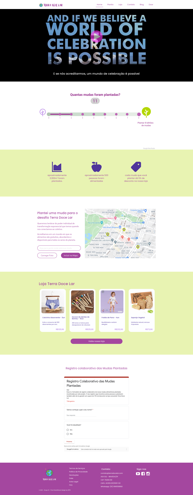

# Desenvolvimento da Landing Page – Solução bônus

A Landing Page tem como objetivo vincular a identidade da Terra Doce Lar. Sem a necessidade de desfragmentar toda sua estrutura atual. A solução tem como objetivo principal fornecer uma página em formato de página única, separada da plataforma Shopify. Para ajudar a captura de público e possibilitar, caso necessário, uma descentralização da plataforma Shopify de forma mais lenta e consistente.

Lista de tecnologias utilizadas:

    • React JS
    • NodeJS
    • Google Maps API
    • Bootstrap

# Iniciando o projeto

1. npm install
2. npm start

# Requerimentos

1. NodeJS

### Landing Pages

